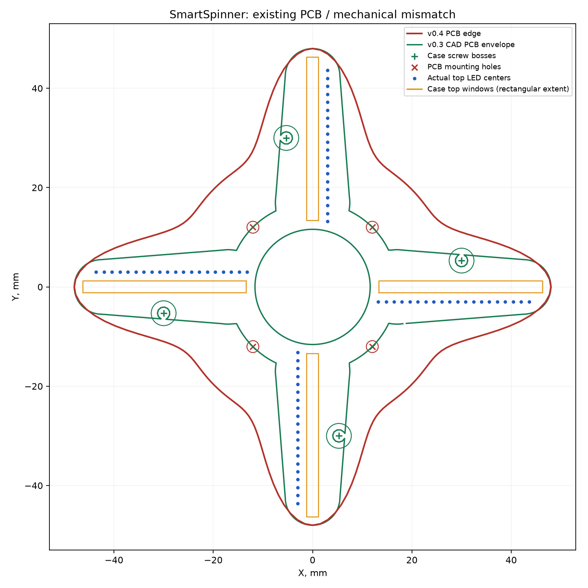

# SmartSpinner — ревизия электроники с нуля

Примечание к публикации 30.09.2026: старые схемы и пакеты сняты из текущего каталога. Все пути и выводы ниже относятся к историческому коммиту [1635129](https://github.com/GermanKlimenko/smartspinner/tree/1635129707aff4e6b09a5e4b1feb32eedf14c7ca). Для повторного запуска аудита восстановите этот снимок в отдельной рабочей копии; не используйте его для изготовления.

Дата: 29 сентября 2026. Проверяемая база: Git `1635129`, схема v0.5, плата v0.4, механика v0.3. Это отчёт о проверке, **не исправленный производственный релиз**.

## Краткий вердикт

**STOP FABRICATION: по существующим файлам заказывать изготовление и монтаж нельзя. Подключать аккумулятор к собранной по ним плате нельзя.**

Проект содержит пригодную для обсуждения концепцию, но не согласованный комплект рабочего устройства. Обнаружены ошибки соединений питания, непригодные посадочные места, расхождение схемы с платой и платы с корпусом. Ранее данная оценка готовности была завышена: это не ситуация «разводчику осталось проверить несколько мелочей».

Сама идея четырёхлучевого POV-спиннера не опровергнута. Предварительно можно сохранить nRF52840/BLE и целевые 4 × 20 верхних + 4 × 12 торцевых RGB-пикселей. Но выбор LED, питание, фазовая синхронизация и размещение требуют новой проверки. Партнёрские картинки не являются доказательством достижимой чёткости.

### Что действительно проверено

- Прочитаны генераторы, исходные KiCad, BOM/CPL, файлы производства и механики.
- KiCad 10.0.6 заново экспортировал электрический netlist; заново выполнены ERC и DRC обеих плат.
- Соединения и посадочные места сопоставлены с документацией компонентов.
- Пересчитаны временной бюджет POV, пределы датчиков и сценарии энергопотребления.
- Контур PCB совмещён с действующими STEP-моделями, посчитаны пересечения твёрдых тел.

Не было изготовленного образца, осциллограмм, оптического теста, измерений температуры, тока, времени работы и радиосвязи. Проверка файлов не заменяет эти испытания. Дубликаты файлов с суффиксом « 2» не принимались за новую ревизию. Исходные проектные файлы не изменялись; контрольные суммы сохранены.

## 1. Подтверждённые блокирующие ошибки

### E01 · P0 · Генератор схемы перепутал физические выводы и сети

В `tools/generate_schematic_v0_5.py:88–92` локальные координаты выводов символа создаются с положительной осью Y вверх; в строке 158 метки соединений ставятся на листе без необходимого переворота Y. Поэтому порядок сетей на каждой стороне многовыводного символа развёрнут. Это не предположение по картинке: результат подтверждён экспортом KiCad.

| Компонент и физический вывод | Фактическая сеть в v0.5 | Требуемая функция |
|---|---|---|
| U5 MCP73831, 4 VDD | GND | Вход зарядки 5 В |
| U5, 2 VSS | CHG_5V | Земля |
| U5, 3 VBAT | CHG_STAT | Аккумулятор |
| U3 TPS61023, 3 VIN | GND | Аккумулятор |
| U3, 4 GND | VBAT | Земля |
| U3, 5 SW / 6 VOUT | 5V_RAW / BOOST_SW | BOOST_SW / 5V_RAW |
| U4 LDO, 1 IN / 2 GND | GND / VBAT | VBAT / GND |
| U4, 5 OUT | Не подключён | 3V3 |
| U1, 51 SWDIO / 53 SWDCLK | 3V3 / 3V3 | Интерфейс программирования |
| U1, 28 VDD / 30 VDDH | SWDCLK / SWDIO | Питание модуля |

Полный список: [schematic-connectivity.json](schematic-connectivity.json), исходный экспорт: [schematic.net.xml](schematic.net.xml). Та же ошибка затрагивает разъёмы и сигнальные цепи. Исправить одну надпись недостаточно: необходимо проверить соответствие каждого вывода каждой сети после регенерации.

Распиновки сверены с [Microchip MCP73831](https://ww1.microchip.com/downloads/en/DeviceDoc/20001984g.pdf), [TI TPS61023](https://www.ti.com/lit/ds/symlink/tps61023.pdf), [TI TPS7A20](https://www.ti.com/lit/ds/symlink/tps7a20.pdf) и [Raytac MDBT50Q](https://www.raytac.com/tw/download/index.php?index_id=24).

### E02 · P0 · «Нет ошибок ERC» здесь не означает исправную схему

В генераторе **все выводы объявлены `passive`**. ERC не получает нормального описания входов питания, выходов, открытых стоков и т. п. Перепутанное питание поэтому не выявляется привычными проверками типов выводов.

Новый прогон дал 89 предупреждений, 0 ошибок категории error. Но E01 остаётся реальной электрической ошибкой. Нужно заменить условные символы проверенными, назначить корректные типы выводов, обработать питание, NC и исключения, затем повторить ERC и ручную проверку netlist. Файл `.kicad_pro` с полноценными настройками проекта в проверяемом комплекте отсутствует.

### E03 · P0 · Неверно рассчитано напряжение повышающего преобразователя

Генератор задаёт R2 = 910 кОм и R3 = 100 кОм и утверждает, что опорное напряжение TPS61023 равно 0,5 В. По таблице electrical characteristics оно типично **0,595 В в PWM**, 0,601 В в PFM.

Расчёт задуманной цепи: `Vout = 0,595 × (1 + 910/100) = 6,0095 В`.

Это выше допустимого диапазона настройки выхода 5,5 В. Защита от перенапряжения вмешается; **расчёт не означает, что реально получится стабильный выход 6 В**. Даже после исправления E01 этот узел останется неправильным. Нужны новый делитель, расчёт допусков и проверка преобразователя с реальной нагрузкой. Источник: [TI TPS61023, таблица 6.5 и типовая схема](https://www.ti.com/lit/ds/symlink/tps61023.pdf).

### E04 · P0 · Посадочные места на PCB — условные заменители реальных корпусов

| Позиция | Площадок в v0.4 PCB | Выводов у указанного компонента |
|---|---:|---:|
| U1 MDBT50Q | 15 | 61 |
| U2, U9 74AHCT125 | 6 на корпус | 14 |
| U3 TPS61023 | 3 | 6 |
| U4 TPS7A20 | 3 | 5 |
| U5 MCP73831 | 3 | 5 |
| U7 BMI270 | 4 | 14 |
| U8 TPS22918 | 3 | 6 |

Это не просто отсутствие 3D-моделей. На эти площадки нельзя установить указанные детали с правильными соединениями. В v0.4 преобразователи изображены как трёхконтактные блоки; входы и выходы логических буферов не представлены как полноценная схема. Инвентаризация: [pcb-inventory.json](pcb-inventory.json).

### E05 · P0 · Схема, BOM и PCB не являются одним согласованным проектом

В схеме 40 символов; 31 без назначенного footprint, включая условные блоки цепочек LED. Все 128 светодиодов не развёрнуты в индивидуальные компоненты. В основной PCB 104 footprint; в одной торцевой 13, а таких торцевых плат предполагается четыре.

L1 и RPROG из BOM не найдены как компоненты основной PCB. Обратная связь и большая часть обвязки в PCB отсутствуют. Нумерация также изменилась: C1–C4 на плате v0.4 — четыре накопительных конденсатора лучей, в схеме v0.5 это другие конденсаторы зарядки и LDO. Нет основания использовать старые BOM/CPL для новой схемы.

Нужны единый проект, одна библиотека, уникальные позиционные обозначения и проверка `schematic ↔ PCB ↔ BOM ↔ CPL`. Экспорт Gerber из существующей геометрии этого не исправляет.

### E06 · P0 · Разводка не завершена, производственный пакет неполон

Свежий DRC основной платы: **68 неподключённых элементов**, плюс 50 прочих нарушений; торцевой: **4 неподключённых**, плюс 7 прочих. Это категории отчёта, не число уникальных цепей. См. [main-drc.json](main-drc.json), [tip-drc.json](tip-drc.json).

В опубликованном каталоге Gerber отсутствуют файлы паяльной маски и пасты для обеих сторон. См. [fabrication-files.json](fabrication-files.json). Наличие файлов меди и сверловки не делает пакет готовым для PCBA.

В основной PCB нет полигонов земли; внутренние слои заявлены, но полноценная структура возвратных токов не реализована. Графический прямоугольник RF keep-out не является запретной зоной для меди всех слоёв. Отверстия переходов 0,15 мм на основной и 0,10 мм на торцевой плате поставлены непосредственно в площадки LED. Это требует отдельного согласования технологии, заполнения/закрытия via-in-pad либо изменения разводки. Очень мягкие DRC-ограничения сами по себе не доказывают производимость.

### E07 · P0 · Корпус и плата физически несовместимы



Красный контур — PCB v0.4; зелёный — посадочный габарит PCB в механике v0.3; синие точки — LED; оранжевые полосы — окна.

- Отверстия PCB стоят около радиуса 17 мм по диагоналям. В корпусе крепёж расположен около точек `(30; 5,3)` мм и их поворотов на 90°. Они не совпадают.
- Лучи PCB существенно шире полостей корпуса. При положении платы Z = 6,5…7,5 мм объём пересечения PCB с нижней частью корпуса составляет около **625 мм³**.
- Даже предусмотренный в v0.3 STEP-габарит платы пересекается с нижней частью корпуса: около **216 мм³**. Поэтому нельзя считать и прежнюю механику полностью проверенной.
- Ряд верхних LED смещён поперёк луча на 3 мм, тогда как полуширина окна 1,2 мм. Ряд не попадает в предусмотренное окно.
- Первый LED начинается с 13,2 мм вместо 14,8 мм; шаг торцевых LED 1,10 мм против 1,05 мм в механике. На 12 позициях разница длины ряда 0,55 мм.
- Проверяемая механика имеет толщину 16 мм, а не первоначальные 12–14 мм. Между верхними LED и рассеивателем есть большой зазор; резкость и паразитная засветка не проверены.

Расчёт выполнен на настоящих STEP-телах, не на иллюстрации. Преобразование координат и допущения сохранены в [mechanical-comparison.json](mechanical-comparison.json). Нужны общие параметры механики и платы, компонентные 3D-модели, проверка всех зазоров и сборки.

## 2. Компоненты, питание и безопасный запуск

### E08 · P0 · MPN датчика Hall не соответствует выбранному корпусу

Указанный **DRV5033AJQLPGM** — вариант TO-92/LPG; в схеме ему назначен SOT-23, а в BOM встречается другой тип корпуса. Более того, назначение выводов 2/3 у LPG и SOT-23/DBZ различается. Нельзя просто заменить рисунок footprint без проверки MPN и pin map. [TI: именно DRV5033AJQLPGM](https://www.ti.com/product/es-mx/DRV5033/part-details/DRV5033AJQLPGM), [распиновки](https://www.ti.com/lit/ds/symlink/drv5033.pdf).

### E09 · P0 · Распиновки LED не подтверждены для заказываемой модификации

На PCB оба типа LED используют `1=VDD, 2=DOUT, 3=GND, 4=DIN`. Документ OPSCO для EC10 показывает `1=GND, 2=DIN, 3=VDD, 4=DOUT`; документ Normand для EC15 — `1=DIN, 2=VDD, 3=DOUT, 4=GND`.

Нумерация и ориентация должны быть согласованы с **конкретным производителем и ревизией**. Для EC10 поворот корпуса может объяснять часть пространственного соответствия, но не доказывает правильность нумерации, CPL и сборочной ориентации. Документ EC15 от Normand не является подтверждением всех вариантов OPSCO. До выбора закупаемой позиции обе посадки остаются неподтверждёнными. Нужны land pattern, pin-1, ориентация ленты и контрольный монтаж.

Источники: [OPSCO EC10 REV.01](https://cdn-shop.adafruit.com/product-files/5849/SK6805-EC10-000_REV.01_EN.pdf), [Normand EC15 REV.05](https://www.normandled.com/upload/202003/SK6805-EC15%20LED%20Datasheet.pdf).

### E10 · P1 · Зарядка и совместимость уровней

Даже по задуманным, ещё не перепутанным соединениям STAT у MCP73831 напрямую идёт в GPIO nRF. Этот выход может выдавать высокий уровень от входного питания зарядки, то есть около 5 В. Для 3,3-вольтового GPIO нужен согласователь либо подходящий вариант выхода с открытым стоком и подтяжкой к 3,3 В.

RPROG = 10 кОм задаёт около 100 мА; это не 150 мА, фигурировавшие в BOM. Для условных 500 мА·ч одна только идеальная зарядка током 100 мА заняла бы 5 часов, реальная с фазой CV — дольше. Отдельного power-path нет: потребление устройства от батарейного узла может нарушать определение окончания зарядки. Следует аппаратно исключить работу LED на зарядке либо спроектировать корректное разделение питания. [Microchip MCP73831/2](https://ww1.microchip.com/downloads/en/DeviceDoc/20001984g.pdf).

Зарядник не заменяет защиту аккумулятора от КЗ/переразряда. Нужны точная модель пакета, допустимые токи, защитная плата и температурные условия зарядки. Две симметричные ячейки нельзя считать согласованным 1S2P-пакетом без определения их соединения, одинаковости и защиты. Полости в корпусе не доказывают существование подходящего аккумулятора на 500 мА·ч.

### E11 · P1 · Питание требует полного пересчёта и проверки переходных процессов

- «3,7 A» у TPS61023 — предел тока ключа, а не гарантированные 3,7 A на выходе 5 В. Нужен расчёт при минимальном напряжении батареи, с потерями, нагревом и насыщением дросселя.
- [TPS22918](https://www.ti.com/lit/ds/symlink/tps22918.pdf) рассчитан на ток до 2 A при оговорённых условиях, но не является программируемым ограничителем тока. Один только предел яркости в прошивке не защищает от её сбоя или всех переходных нагрузок.
- На LED_EN нет гарантированного выключенного состояния внешним резистором. Нужно определить запуск, сброс MCU, отключение и последовательность шин. ON нельзя оставлять плавающим. Неподключённый QOD сам по себе допустим и не является доказанной ошибкой.
- 3,3-вольтовый LDO от Li-ion перестаёт стабилизировать 3,3 В в нижней части разряда. Это не обязательно останавливает MCU, но требует проверки минимального питания всех узлов и порога отключения. [TPS7A20](https://www.ti.com/lit/ds/symlink/tps7a20.pdf).
- Недостаточно локальной развязки у контроллера, буферов, Hall и цепей LED. Требуется расчёт эффективной ёмкости с DC-bias, токов по лучам, провалов питания, возвратных путей и помех BLE.
- Режим «LED показывают чёрный» и режим «питание LED выключено» имеют разное потребление. Для ожидания нужно физическое отключение световой части.

### E12 · P1 · Буферы, GPIO, программирование и RF

74AHCT125 — подходящий класс согласования 3,3 → 5 В при правильном подключении: AHCT питается от 4,5–5,5 В и имеет TTL-порог входа. В старой PCB буферы сидят на 3V3 и не реализуют нужное преобразование. Входы актуального Nexperia имеют overvoltage tolerance; поэтому утверждать неизбежную обратную подпитку именно через их входную защиту нельзя. Всё равно необходимо проверить поведение выключенных шин и выходов. [Nexperia 74AHC/AHCT125](https://assets.nexperia.com/documents/data-sheet/74AHC_AHCT125.pdf).

Задуманное назначение P0.03/P0.09/P0.10 под высокочастотные LED-данные не учитывает RF-рекомендации модуля: эти выводы имеют ограничения при активном радио. Нужен новый GPIO-план, проверка NFC-конфигурации, режима питания модуля, неиспользуемых выводов и физического keep-out антенны. [Raytac MDBT50Q](https://www.raytac.com/tw/download/index.php?index_id=24).

SWD-разъём не согласован: пять выводов в схеме, четыре площадки на PCB, шестиконтактный интерфейс в BOM. Для варианта TC2030-CTX контакт 3 — reset, 4 — clock; задуманная схема меняет их местами. Нужно выбрать конкретный кабель и посадку, обеспечить доступ при сборке. [Tag-Connect TC2030-CTX](https://www.tag-connect.com/product/tc2030-ctx-etm).

## 3. Сможет ли это показывать картинку

### E13 · P1 · Четыре луча не устраняют ограничения LED

Проверяемая гипотеза: восемь независимых цепочек — четыре по 20 LED сверху и четыре по 12 LED на торце, передача 800 кбит/с, 24 бита на RGB, reset более 80 мкс. Нижние границы времени обновления — около 680 и 440 мкс соответственно. Это оптимистичный предел без затрат прошивки, а не измеренная производительность.

| Скорость, об/мин | Проходов 4 лучей в секунду | Обновлений за оборот одной верхней цепочки, не более | Торцевой, не более |
|---:|---:|---:|---:|
| 300 | 20 | 294 | 454 |
| 600 | 40 | 147 | 227 |
| 900 | 60 | 98 | 151 |
| 1200 | 80 | 73 | 113 |

При 900 об/мин за 680 мкс точка на радиусе 50 мм перемещается примерно на 3,20 мм. У реального крайнего верхнего LED радиус меньше, поэтому линейное перемещение немного меньше. Это ограничивает угловую детализацию. Четыре луча увеличивают повторяемость изображения; нельзя одновременно считать их безусловным четырёхкратным приростом и частоты, и углового разрешения.

Отдельный предел — внутренний PWM светодиода. В проверенных документах встречаются 1,2 кГц для EC15 и 4 кГц для EC10; другие ревизии могут отличаться. PWM не синхронизирован с вращением, поэтому нужно проверить оптическую задержку, полосы и разрывы на малой яркости. Нельзя выводить качество изображения только из скорости передачи данных.

**Вывод:** выбранные LED не доказаны как подходящие для обещанной чёткой графики. Это не доказательство невозможности POV. До окончательной разводки нужен оптический стенд с реальными закупаемыми LED и измерением света фотодиодом. Если результата нет — переход на проверенное быстрое тактируемое решение или RGB-драйверы с управляемыми latch/OE. Конкретный заменяющий компонент пока не выбран; его геометрия и токи тоже потребуют расчёта.

20 LED по лучу дают 20 радиальных отсчётов, не квадрат 20 × 20. Центральная область остаётся без изображения из-за подшипника и пальцев. Полярный рендеринг должен учитывать реальные координаты каждого LED, а не только радиус.

### E14 · P1 · nRF52840 предварительно пригоден, доказательной прошивки нет

У nRF52840 есть четыре PWM-блока по четыре канала с EasyDMA. Поэтому восемь параллельных потоков технически возможны; отдельный GPIO на каждый из 128 LED не нужен. Но требуется реализовать и измерить генерацию восьми потоков, фазовую синхронизацию и работу одновременно с BLE. В проверяемом проекте рабочая прошивка этого не обнаружена. [Nordic: возможности nRF52840](https://docs.nordicsemi.com/r/bundle/ps_nrf52840/page/keyfeatures_html5.html).

Нужны обработчик Hall с аппаратными timestamp, планировщик угла, корректировка изменения периода, буферы полярного изображения, watchdog, контроль батареи и аппаратно безопасное гашение при остановке/сбросе. Bluetooth должен передавать содержимое, не задавать точные моменты включения LED.

### E15 · P1 · BMI270 не подходит для заявленной роли измерителя скорости вращения

Максимальный диапазон гироскопа ±2000°/с соответствует около **333 об/мин**. При 600 об/мин уже 3600°/с, при 900 — 5400°/с. Он будет насыщаться, поэтому не может гарантированно компенсировать скорость и фазу в этом диапазоне.

При радиусе 14 мм и 1200 об/мин центростремительное ускорение около 22,5g, выше диапазона акселерометра ±16g. IMU можно оставить для других задач после пересмотра роли, но не обещать на его основе стабилизацию изображения. [Bosch BMI270](https://www.bosch-sensortec.com/en/products/motion-sensors/imus/bmi270).

### E16 · P1 · Hall, магнит и дрожание руки

В механике **есть** карман магнита в неподвижной относительно пальцев крышке — неверно было бы объявлять магнит полностью забытым. Но модель, ориентация и поле магнита не заданы в BOM; положение Hall на PCB не совпадает с механической разметкой. Работу рядом со стальным подшипником, допуски зазора и стабильность импульса никто не измерял.

Одна метка за оборот даёт период и индекс, но не непрерывный угол между импульсами. Она не измеряет направление без дополнительных предположений. Если крышка поворачивается в пальцах, вместе с ней меняется опорное направление картинки. Дрожание оси также не исправляется одной меткой.

Для первой версии рационально разделить: синхронизацию относительно крышки, оценку изменения скорости и отдельно устойчивость изображения в руке. Жёсткий стенд нужен для измерений и отладки; из этого не следует, что устройство сможет работать только на подставке. Финальное доказательство удобства и чёткости — тест в руке, а не рендер.

## 4. Энергия: новый расчёт вместо обещания автономности

128 RGB-пикселей — это до 384 цветовых каналов. При условных 5 мА на канал полный белый требует **1,92 A при 5 В только на свечение**, ещё до собственного потребления микросхем LED. «5 мА на пиксель» не равно «5 мА на каждый цвет».

Следующая таблица — **сценарная чувствительность, не спецификация батареи и не прогноз измеренной автономности**. Приняты условные 0,5 мА собственного тока каждого LED, 5 мА на цветовой канал, КПД boost 85%, батарея 3,7 В / 500 мА·ч, используемая ёмкость 85%, прочая электроника 15 мА от батареи. Токи конкретных ревизий LED и реальная ёмкость подходящего пакета пока не подтверждены.

| Средняя загрузка цветовых каналов | Ток LED по 5 В | Ток батареи | Расчётное время |
|---:|---:|---:|---:|
| 0%, питание LED включено | 64 мА | 117 мА | 218 мин |
| 10% | 256 мА | 422 мА | 60 мин |
| 25% | 544 мА | 880 мА | 29 мин |
| 35% | 736 мА | 1185 мА | 22 мин |
| 100%, полный белый | 1984 мА | 3169 мА | 8 мин — математически, режим не разрешён |

«Загрузка» учитывает одновременно долю светящихся точек, яркость и количество активных цветов. Это не просто положение ползунка яркости. Редкий зелёный текст и сплошной белый диск дают совершенно разные результаты. При низком напряжении батареи входной ток ещё выше. Возможности маленького аккумулятора, защита и нагрев могут исключить режим задолго до расчётного исчерпания ёмкости.

Ограничение яркости снижает средний ток, но не обязательно амплитуду импульсов PWM. Проверять нужно среднюю и пиковую нагрузку, ёмкости и провалы питания. Пока корректный ответ об автономности: **не установлена**. Все формулы и допущения: [calculations.json](calculations.json).

## 5. Предлагаемая архитектура следующей ревизии

Сохранить целевой форм-фактор и BLE как требования, но не копировать нынешнюю разводку. Рекомендуемый порядок решений:

1. **Оптика до финальной PCB.** Один луч 20 LED и один торец 12 LED, настоящий световой тест в диапазоне 300–1200 об/мин. Диапазон — испытательный, а не утверждение о типичной скорости в руках. Выбрать допустимое качество текста, мерцание, яркость и минимальные рабочие обороты.
2. **Согласовать аккумулятор и питание.** Выбрать физически существующий защищённый пакет, токовый бюджет, зарядку, режим на доке и аппаратное выключение LED. После этого выбирать преобразователь и ограничение нагрузки.
3. **Собрать полную принципиальную схему заново.** Реальные символы, все светодиоды и обвязка, разъёмы, измерительные точки, программирование, режимы включения/выключения. Добавить автоматические проверки критических pin-to-net соединений, чтобы ошибка генератора не повторилась.
4. **Совместно переработать размещение и корпус.** Единый DXF/параметры, допустимые зоны компонентов, световые окна, высоты, антенна, магниты, батарея, крепёж и балансировка по реальным массам. Четыре одинаковых луча сами по себе баланс не гарантируют. Торцевые платы должны фиксироваться корпусом; пайка не должна воспринимать удар раскрутки.
5. **Развести согласованную плату.** Проверенные footprints из документации поставщиков, питание/земля/RF, технологические ограничения выбранного производства. Устранить все неподключения, разрешить каждое исключение ERC/DRC, сравнить netlist.
6. **Первый экземпляр и испытания.** Лабораторный источник с ограничением тока до аккумулятора; проверка шин, зарядки, запуска, LED, Hall, BLE и температуры. Затем безопасный тест вращения в защитном ограждении и тест в руке. Лишь после этого — партия 10 устройств.

### Критерии готовности к заказу

- Одна версия KiCad: `.kicad_pro`, `.kicad_sch`, `.kicad_pcb`, локальные библиотеки и 3D-модели.
- PDF полной схемы, BOM с точными MPN и допустимыми заменами, CPL, сборочные чертежи с pin-1 и ориентацией.
- Gerber меди, маски, пасты, шелкографии и контура; сверловка, стек слоёв, требования via-in-pad и панелизации.
- Разъёмы и четыре торцевых модуля согласованы по числу, нумерации, стороне и монтажу.
- ERC/DRC и сверка схемы с платой без необъяснённых нарушений; независимая проверка питания и распиновок; DFM от изготовителя.
- Расчёты питания, токов, нагрева и световых таймингов; согласованная батарея и механика.
- Прошивка для проверки, инструкция первого включения и критерии приёмки.

Отдельный критерий после изготовления: реальная чёткость POV, автономность, нагрев, безопасность батареи и прочность подтверждены измерениями. Даже идеальные файлы не дают этого доказательства заранее.

## 6. Что это означает для переговоров с разработчиком

Нужен заказ **на разработку и проверку электроники прототипа**, а не только на трассировку готовой схемы. Изготовитель PCBA может выпустить и собрать платы по согласованным файлам, но не обязан бесплатно доводить принцип работы и исправлять архитектуру.

Техническое возражение, что имеющейся схемы недостаточно, подтверждается аудитом. При этом аудит не проверяет коммерческую оценку Азата и не позволяет обещать конкретное число часов экономии. Будущему исполнителю стоит передать этот отчёт и исходники как материал для ревизии, прямо исключив использование старых Gerber для заказа.

## 7. Воспроизводимость и границы изменений

Добавлены только файлы аудита и два проверочных скрипта; старые схема, PCB, CAD, сайт и производственные архивы не исправлялись и не публиковались. Письма и сообщения никому не отправлялись.

Запуск из корня репозитория:

```bash
python3 tools/audit_electronics.py
.venv/bin/python tools/audit_electromechanical.py
```

Первый скрипт использует установленный KiCad CLI 10.0.6; второй — CadQuery и Matplotlib из локальной `.venv`. Путь KiCad задан явно и на другом компьютере требует настройки. Скрипты читают исходники и записывают отчёты в эту папку. Существующие проектные генераторы в ходе аудита не запускались.

Доказательства: [команды и коды возврата](commands.json), [контрольные суммы исходников](source-hashes.json), [ERC](erc.txt), [DRC основной платы](main-drc.json), [DRC торцевой платы](tip-drc.json), [инвентаризация PCB](pcb-inventory.json), [расчёты](calculations.json), [геометрическое сравнение](mechanical-comparison.json).

Это широкий аудит доступных файлов и ключевых проектных допущений, а не сертификация и не гарантия отсутствия других ошибок. Точные компоненты, исправленная схема, полная разводка и измерения первого экземпляра ещё предстоят.
